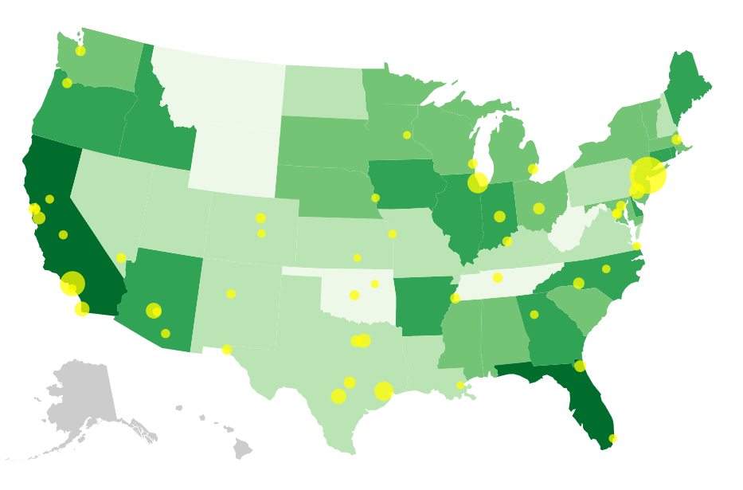

## US Urban Areas and Agricultural Productivity
Following along with the book, "Interactive Data Visualization for the Web", I produced a choropleth web map of the US. States are coded according to agricultural productivity where more intense color = higher productivity. The largest 50 cities are overlaid on top of the map as yellow bubbles. D3 V5 was used for producing the map.

## Map

## Sources
- Scott Murray, "Interactive Data Visualization for the Web"
- ColorBrewer: http://colorbrewer2.org
- US Department of Agriculture: http://data.gov
- US Census
- D3, http://d3js.org/